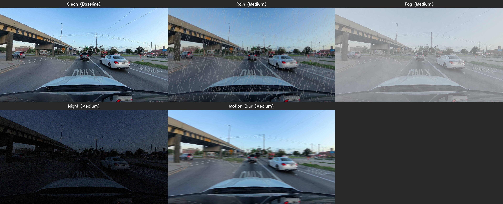
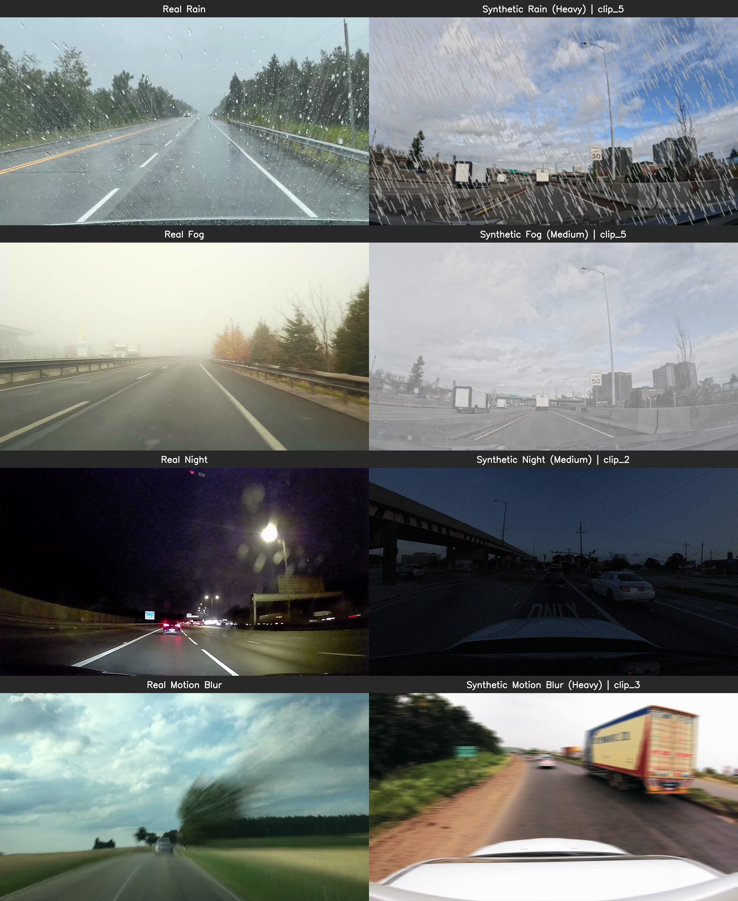
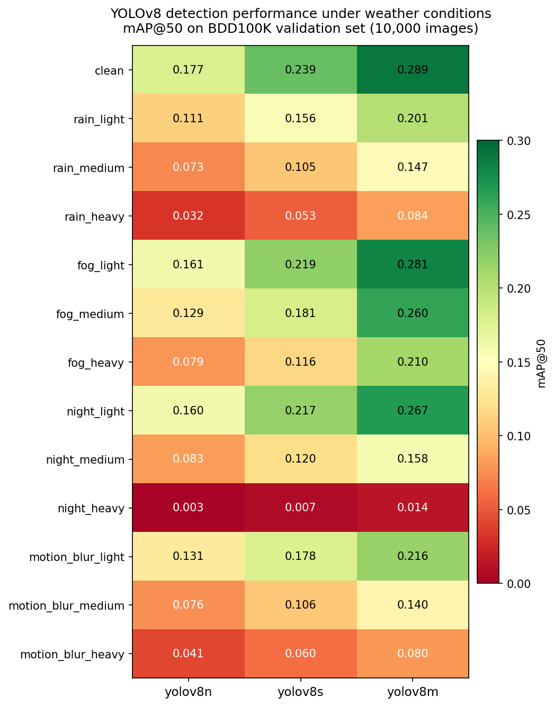
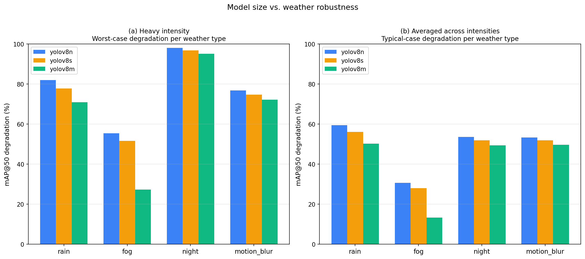
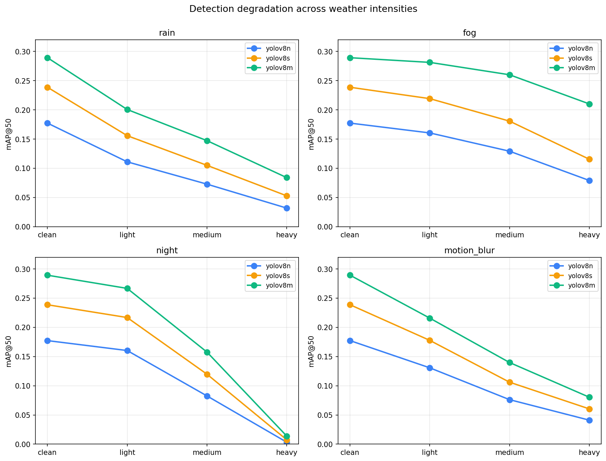
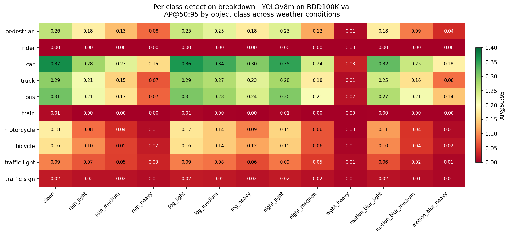

# WeatherSense

**Stress-testing object detection models under adverse driving conditions.**

I synthesize rain, fog, low-light, and motion blur on clean dashcam footage and measure how much each condition degrades YOLO's per-class detection accuracy. The goal is a deployable tool that quantifies — not just visualizes — where a perception model breaks.



*Clean baseline (top-left) with rain, fog, night, and motion blur applied at medium intensity. Same scene, same objects, four failure modes.*

---

## Status

**Phases 1 and 2 are done.** Augmentations are built and validated, and I ran the full benchmark — 3 YOLOv8 models × 13 weather conditions × 10,000 BDD100K images on my M1 Mac (took about 17 hours of compute).

**The headline finding:** YOLOv8 detection collapses to under 1.5% mAP@50 in heavy synthetic night conditions across all three model sizes. But fog is the opposite story — the biggest model (yolov8m) loses only 27% under heavy fog, versus 55% for the smallest model. Different weather types apparently break detection through different mechanisms, and that's the interesting part.

| Phase | Focus | Status |
|---|---|---|
| 1 | Data pipeline + 4 weather augmentations | ✅ Done |
| 2 | YOLOv8 inference + BDD100K mAP benchmarking | ✅ Done |
| 3 | FastAPI service + degradation report visualization | Working on it |
| 4 | MLflow tracking + Docker + AWS deployment | Planned |
| 5 | CI/CD + documentation polish | Planned |

---

## Why I built this

YOLO benchmarks are reported on clean, well-lit, daytime images. In the real world — autonomous vehicles, traffic cameras, dashcam ADAS — those conditions don't hold. A model that hits 92% mAP on COCO might drop to 60% in fog, and nobody actually knows by how much until something goes wrong on the road.

WeatherSense tries to close that gap by:

1. **Synthesizing controlled adverse conditions** on clean footage where the ground truth is known.
2. **Running detection inference** on clean and degraded frames side-by-side.
3. **Quantifying per-class accuracy loss** — so I can tell whether the model fails first on pedestrians, traffic signs, or distant vehicles.

The interesting part isn't "YOLO works worse in bad weather" (everyone knows that). It's *which* conditions break it most, *how* the degradation scales with intensity, *which* object classes fall apart first, and whether using a bigger model actually helps.

---

## Weather augmentations

Four conditions, each at three intensity levels (light / medium / heavy).

| Condition | Approach | What it models |
|---|---|---|
| **Rain** | Albumentations `RandomRain` with tuned drop geometry | Streaks, blur, brightness reduction |
| **Fog** | Custom 3-stage pipeline: patchy fog + uniform haze + contrast reduction + desaturation | Atmospheric scattering, mid-distance visibility loss |
| **Night** | Brightness scaling + gamma correction + blue shift + Gaussian noise | Low-light / civil twilight (see Limitations) |
| **Motion Blur** | Directional kernel convolution via `cv2.filter2D` | Camera shake, lateral motion |

### Real vs. synthetic validation

I validated each augmentation against a real-world Pexels reference clip with a categorically matching scene, then tuned synthetic intensities to roughly match the severity of the real reference.



*Left column: real-world Pexels reference clips. Right column: my synthetic augmentations applied to scene-matched clean dashcam frames. Fog and rain look pretty convincing; night and motion blur are first-order approximations and I've been upfront about their limits below.*

---

## Phase 2 findings

**What I did.** I ran three YOLOv8 variants (n, s, m) on the entire BDD100K validation set (10,000 driving images) across 13 conditions — a clean baseline plus four weather types at three intensities each. That's 390,000 inferences total. mAP was computed with the pycocotools backend through torchmetrics.



*Detection mAP@50 across all 39 (model, condition) pairs. Green means strong performance, red means collapse. The `night_heavy` row at the bottom of the night group drops every model below 1.5% mAP.*

### Five things I found worth highlighting

**1. Bigger models help, but only a bit.** yolov8m beats yolov8n by 35-63% on the clean baseline (0.289 vs 0.177 mAP@50). The pattern of weather degradation looks similar across model sizes though — heavier conditions still hit performance hard regardless of how big the model is.

**2. Night_heavy is catastrophic for every model.** All three variants drop to near-zero mAP@50 (0.003, 0.008, 0.014). Quadrupling the model size from n to m only moves accuracy from 0.34% to 1.39%. **Scale doesn't fix deep-night detection.** This was the most surprising finding to me — I'd expected the bigger model to handle it better. For a safety-critical context, this is a big deal.

**3. Fog is the one weather type where model size really matters.** Under fog_heavy, yolov8m loses only 27% of its clean performance, while yolov8n loses 55%. No other weather type shows this big a benefit from scaling. My guess is that fog's uniform contrast reduction is something a higher-capacity model can compensate for, while structured artifacts like rain streaks or motion blur disrupt detection in a way capacity alone can't fix. I'd want to test this hypothesis more carefully in future work.



*Left: worst-case degradation at heavy intensity. Right: typical-case degradation averaged across all intensities. Fog shows the strongest model-scale benefit; night shows almost none.*

**4. Each weather type has a different "shape" of degradation.** Fog declines gracefully — it's almost flat from clean to light, then gradual to heavy. Night drops gently from clean to light, then falls off a cliff between medium and heavy. Rain and motion blur are roughly linear. These different shapes suggest the underlying mechanisms are different, which is interesting on its own.



*mAP@50 vs intensity for each weather type. The night curve's cliff between medium and heavy is the most distinctive thing in the whole dataset.*

**5. Some object classes fall apart way faster than others.** Cars and trucks hold up reasonably well even in medium weather. Pedestrians, motorcycles, and bicycles collapse much earlier. Traffic signs and `rider` show consistently low AP across everything — but that's because of how COCO classes map to BDD, not because of weather. I've called that out as a known limitation.



*Per-class AP@50:95 for yolov8m across all 13 conditions. The vulnerable classes (motorcycle, bicycle, traffic sign) degrade fastest and most completely.*

Interactive versions of all 4 charts are in `docs/charts/` — you can hover for exact numbers.

### Reproducing the benchmark

```bash
# Full benchmark (~17 hours on M1 CPU; produces 39 CSVs in results/stage5/)
caffeinate -i python -u notebooks/full_benchmark.py 2>&1 | tee logs/stage5_run.log

# Consolidate into a single master CSV
python notebooks/stage6_consolidate.py

# Generate all 4 charts (PNG + interactive HTML)
python notebooks/visualise_stage6.py
```

If you want to test the pipeline without the 17-hour commitment, I also have `notebooks/smoke_test.py` — 200 images × 13 conditions, about 4 minutes.

---

## Project structure

    WeatherSense/
    ├── data/
    │   ├── raw/                    # 5 Pexels CC0 dashcam clips (Phase 1)
    │   └── real_weather/           # 4 Pexels CC0 weather reference clips
    ├── notebooks/
    │   ├── data_check.py           # Frame extraction sanity check
    │   ├── test_rain.py            # Per-condition 2x2 intensity grids
    │   ├── test_fog.py
    │   ├── test_night.py
    │   ├── test_motion_blur.py
    │   ├── build_unified_grid.py   # All-augmentations grid per clip
    │   ├── build_real_vs_synthetic.py
    │   ├── check_bdd_data.py       # Phase 2: BDD loader sanity check
    │   ├── check_yolo_inference.py # Phase 2: YOLO wrapper validation
    │   ├── check_yolo_by_scene.py  # Phase 2: scene-stratified inference
    │   ├── check_map_baseline.py   # Phase 2: 200-image mAP sanity check
    │   ├── smoke_test.py           # Phase 2: 200 images x 13 conditions
    │   ├── full_benchmark.py       # Phase 2: full 3 x 13 x 10K benchmark
    │   ├── stage6_consolidate.py   # Phase 2: merge 39 CSVs into master
    │   └── visualise_stage6.py     # Phase 2: 4 charts (PNG + HTML)
    ├── src/
    │   ├── augmentations/          # Rain, fog, night, motion blur (Phase 1)
    │   ├── detection/              # BDD dataset loader + YOLO wrapper (Phase 2)
    │   ├── evaluation/             # MAPEvaluator wrapping torchmetrics
    │   └── utils/                  # Frame I/O
    ├── results/
    │   ├── stage5/                 # 39 per-(model, condition) CSVs
    │   ├── phase2_smoke_test.csv   # 200-image pipeline validation
    │   └── phase2_master_results.csv  # Master long-format results
    ├── docs/
    │   ├── images/                 # Phase 1 hero images + Phase 2 PNG charts
    │   └── charts/                 # Interactive Plotly HTML versions
    ├── logs/                       # Benchmark run logs
    ├── outputs/                    # Phase 1 generated visuals (gitignored)
    ├── requirements.txt
    └── README.md

---

## Setup

Python 3.12 is what I used.

```bash
git clone https://github.com/21Mandar/WeatherSense.git
cd WeatherSense

python3.12 -m venv venv
source venv/bin/activate          # macOS / Linux
# .\venv\Scripts\activate         # Windows

pip install -r requirements.txt
```

**One warning from personal experience:** don't clone this into an iCloud Drive (or any cloud-synced) folder. iCloud's lazy file fetching makes Python imports run 50-100x slower, which makes the long benchmark effectively impossible to run. I lost a few hours debugging this. Use a plain local directory like `~/WeatherSense` or `~/projects/WeatherSense`.

### Reproduce the Phase 1 visuals

```bash
# Each augmentation individually (produces 2x2 intensity grids)
python notebooks/test_rain.py
python notebooks/test_fog.py
python notebooks/test_night.py
python notebooks/test_motion_blur.py

# Combined grid: all four augmentations on each clean clip
python notebooks/build_unified_grid.py

# Real-vs-synthetic comparison against Pexels reference clips
python notebooks/build_real_vs_synthetic.py
```

All Phase 1 outputs land in `outputs/`.

### Reproduce the Phase 2 benchmark

See "Reproducing the benchmark" above. You'll need the BDD100K validation set at `~/datasets/bdd100k/` (about 6 GB) and roughly 17 hours of wall-clock time on Apple M1 CPU. The Stage 6 visualization scripts assume Stage 5 results exist in `results/stage5/`.

---

## Dataset

**Clean source clips (Phase 1)** — 5 Pexels CC0 dashcam clips spanning US arterials, US suburbs, Indian highways, and varied lighting. Mixed resolutions (720p–4K) downsampled to 1280×720 on the fly; originals untouched.

**Real-weather reference clips (Phase 1)** — 4 Pexels CC0 clips I used as visual baselines for validation (not for quantitative benchmarking).

**Benchmark dataset (Phase 2)** — BDD100K validation split (10,000 labeled driving images with ground-truth bounding boxes for 10 detection classes). All 10K images used in the full benchmark; no sampling. Dataset available via the [BDD100K project](https://bdd-data.berkeley.edu/) or Hugging Face `dgural/bdd100k`.

---

## Limitations

I'd rather be upfront about these than hide them. WeatherSense is a perception-degradation testing tool, not a photorealistic weather generator or a production safety system.

**Phase 1 augmentation limitations**

- **Night augmentation models civil twilight / low-light**, not deep urban night with active artificial lighting. Generating realistic streetlights, taillight glare, and headlight cones from daytime source frames would need depth-aware light placement or generative models — both out of scope for v1.
- **Fog is depth-uniform**, not depth-dependent. Real fog density scales with distance; my version applies a uniform haze layer. A depth-aware version would need a monocular depth model in the pipeline.
- **Motion blur is uniform-directional**, not optical-flow-derived. Real motion blur varies by image region (foreground vs background, center vs edge). The current kernel applies the same blur everywhere.
- **Rain models streaks but not windshield droplets or wet-pavement reflections.** Streaks alone produce detection degradation in published studies, but the visual gap to real heavy rain is noticeable.

**Phase 2 measurement limitations**

- **YOLO is evaluated zero-shot — I did not fine-tune on BDD.** Out-of-the-box COCO-trained YOLOv8 gets ~0.18-0.29 mAP@50 on BDD val depending on model size, which is substantially lower than the same models report on COCO. Fine-tuning would give different absolute numbers, but the relative weather-degradation patterns should mostly transfer.
- **COCO→BDD class mapping is imperfect.** The `rider` class has no COCO equivalent and consistently shows AP=0.00. The `traffic_sign` class only maps from COCO's `stop_sign`, which misses most BDD traffic signs. These are cross-dataset limitations, not weather effects.
- **Night_heavy might be too aggressive.** A 95-99% mAP collapse is dramatic, and the brightness/gamma-based dimming may produce darker images than typical real-world night driving (which usually has streetlights, headlights, etc.). I'd treat night_heavy as an upper-bound estimate of degradation rather than a typical case.
- **Fog_heavy might be too conservative.** Since the fog is depth-uniform, it probably underestimates real fog impact at distance. A depth-aware fog augmentation would likely show stronger degradation.

These are deliberate scope choices for v1. The degradation patterns I observed (especially the non-linear shapes and per-class vulnerability) reflect real mechanisms that more sophisticated augmentations would intensify, not invert.

---

## Tech stack

OpenCV 4.10 · Albumentations 1.4 · Ultralytics YOLOv8 · NumPy · Matplotlib · Plotly · torchmetrics · pycocotools · Python 3.12

Later phases will add: FastAPI · MLflow · Docker · AWS (EC2/S3) · GitHub Actions

---

## License

MIT — see `LICENSE`.

Source dashcam footage and real-weather reference clips are from Pexels under the Pexels License (free commercial use, no attribution required; attribution provided in `data/SOURCES.md` for traceability).